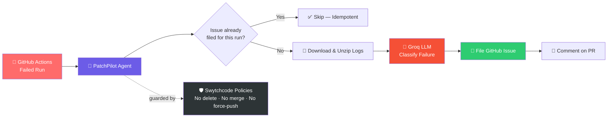

<div align="center">


# 🚀 PatchPilot

### Your AI co-pilot for CI failures — diagnosed and filed before you even open the logs.

[](https://git.io/typing-svg)

<br/>

[](https://www.python.org/)
[](https://console.groq.com/)
[](https://github.com/features/actions)
[](https://www.swytchcode.com/)
[](#license)

<br/>

[](https://github.com/shubhmohan)
[](https://github.com/shubhmohan)
[](https://github.com/shubhmohan/Patch_Pilot/stargazers)

<br/>

**Built by [@shubhmohan](https://github.com/shubhmohan)**

</div>

---

## 📚 Table of Contents

- [The Problem](#-the-problem)
- [What It Does](#-what-it-does)
- [Architecture](#-architecture)
- [Tech Stack](#-tech-stack)
- [Project Structure](#-project-structure)
- [Setup](#-setup)
- [Production-Readiness Features](#-production-readiness-features)
- [Example Output](#-example-output)
- [Why This Matters](#-why-this-matters)
- [Known Limitations](#-known-limitations--next-steps)
- [Author](#-author)

---

## 🔥 The Problem

CI failures usually get one of two treatments: **ignored**, or **blindly re-run** without anyone reading *why* they broke.

That means:
- 🐛 Real bugs slip through disguised as "just re-run it"
- 🎲 Flaky tests quietly erode trust in the whole pipeline
- 🔁 The same failure gets manually diagnosed over and over by different people

**PatchPilot turns a red ❌ into an already-triaged, already-explained GitHub issue the moment it happens.**

---

## ⚡ What It Does

<table>
<tr><td>1️⃣</td><td><b>Detects</b> — checks a GitHub repo for recently failed Actions runs</td></tr>
<tr><td>2️⃣</td><td><b>Investigates</b> — downloads and unzips the failing run's logs</td></tr>
<tr><td>3️⃣</td><td><b>Diagnoses</b> — sends the logs to Groq (<code>openai/gpt-oss-120b</code>), which classifies the failure as <code>FLAKY_TEST</code>, <code>REAL_BUG</code>, or <code>ENV_CONFIG</code> and drafts a root-cause + suggested fix</td></tr>
<tr><td>4️⃣</td><td><b>Acts</b> — files a labeled GitHub issue with that analysis, and comments on any linked PR</td></tr>
<tr><td>5️⃣</td><td><b>Stays idempotent</b> — checks for an existing issue on that run before creating a new one, so re-runs never spam duplicates</td></tr>
</table>

---

## 🏗️ Architecture



*(This diagram renders live and zoomable directly on GitHub — no image needed.)*

---

## 🧰 Tech Stack

| Layer | Tool |
|---|---|
| 🐍 Language | Python 3.12 |
| ⚙️ GitHub execution | [Swytchcode CLI](https://docs.swytchcode.com) — auth, retries, policy-guarded execution |
| 🧠 LLM reasoning | Groq API (`openai/gpt-oss-120b`) |
| 🔐 Auth | Swytchcode's built-in OAuth2 provider connection |

---

## 📁 Project Structure

```
patch-pilot/
├── main.py                # Orchestrates detect → diagnose → act
├── classify.py             # Calls Groq to classify a failure from raw logs
├── swytchcode_client.py    # Wraps all Swytchcode CLI exec calls
├── requirements.txt
├── .env.example
└── README.md
```

---

## 🛠️ Setup

<details>
<summary><b>Click to expand setup instructions</b> 👇</summary>

<br/>

**Prerequisites:** Swytchcode CLI installed, initialized (`swytchcode init`), GitHub bundle fetched (`swytchcode get github`), and GitHub connected (`swytchcode auth connect github`).

```bash
pip install -r requirements.txt
cp .env.example .env
# fill in GROQ_API_KEY, GITHUB_OWNER, GITHUB_REPO in .env
python main.py
```

Get a free Groq API key at [console.groq.com](https://console.groq.com) → API Keys.

</details>

---

## 🛡️ Production-Readiness Features

This wasn't built as a toy demo — it implements the two things that make "AI agent calls real APIs" actually safe to run unattended.

<details>
<summary><b>🔁 Idempotency</b> — click to expand</summary>

<br/>

GitHub's issue-creation API has no built-in idempotency key. Real idempotency here means: every issue PatchPilot files gets tagged with a deterministic label (`ci-run-{run_id}`). Before creating a new issue, PatchPilot searches for that label first — if one exists, it skips instead of duplicating.

</details>

<details>
<summary><b>🚧 Policy Guardrails</b> — click to expand</summary>

<br/>

5 explicit guard policies block this agent from ever taking a destructive action, even if a bug or bad LLM output tried to trigger one:

| Policy | Blocks |
|---|---|
| Block repo deletion | `github.repo.delete`, `github.repo.delete1` |
| Block merges | `github.merge.create`, `github.pull.merge.update`, `github.pull.updateBranch.update` |
| Block ref force-updates/deletes | `github.git.refs.update`, `github.git.refs.delete` |
| Block branch protection changes | `github.branche.protection.update`, `github.branche.protection.delete` |
| Block repo settings changes | `github.repo.update`, `github.repo.update1` |

✅ Verified working — attempting a blocked action returns `POLICY_BLOCKED` before any HTTP call is made:
```powershell
swytchcode exec github.repo.delete --input owner=... --input repo=... --dry-run
# → blocked by policy, no HTTP call made
```

</details>

---

## 📟 Example Output

<details>
<summary><b>Click to see a real run</b> 👇</summary>

```
Checking shubhmohan/Patch_Pilot for failed runs...

Triaging run #34098639400 (CI)...
Classification: ENV_CONFIG
Filed issue: https://github.com/shubhmohan/Patch_Pilot/issues/1
```

</details>

---

## 💡 Why This Matters

- 👤 **Solo developers** — an always-on first-pass triage engineer so CI noise doesn't get ignored
- 👥 **Teams** — reduces the "who's going to look at this failing build" bystander effect
- 🎓 **As a demonstration** — a complete, production-minded agent pattern (detect → reason → guarded action → idempotent execution) that generalizes far beyond CI triage

---

## 🔭 Known Limitations & Next Steps

<details>
<summary>Click to expand</summary>

- Currently polls on-demand rather than reacting to a live webhook — a scheduled cron run or webhook listener would make this fully autonomous
- Classification quality depends on log length (truncated to ~8000 characters per call)
- Slack escalation is scoped but not yet wired in — see `SLACK_CHANNEL_ID` in `.env.example`

</details>

---

## 👤 Author

<div align="center">

**Built with 🤖 + ☕ by [@shubhmohan](https://github.com/shubhmohan)**

[](https://github.com/shubhmohan)

⭐ **If this project helped you, consider giving it a star!** ⭐

</div>
